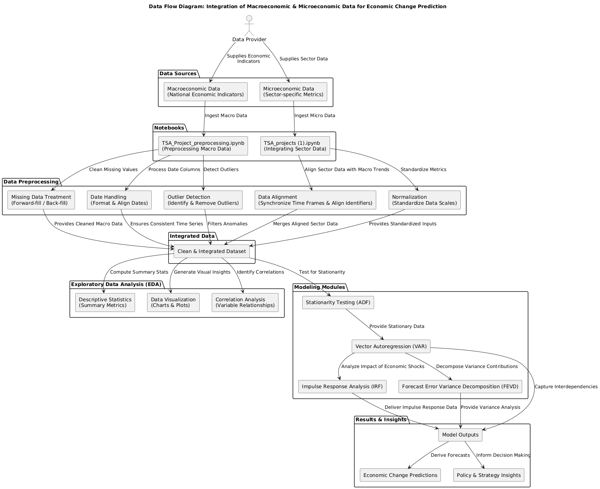
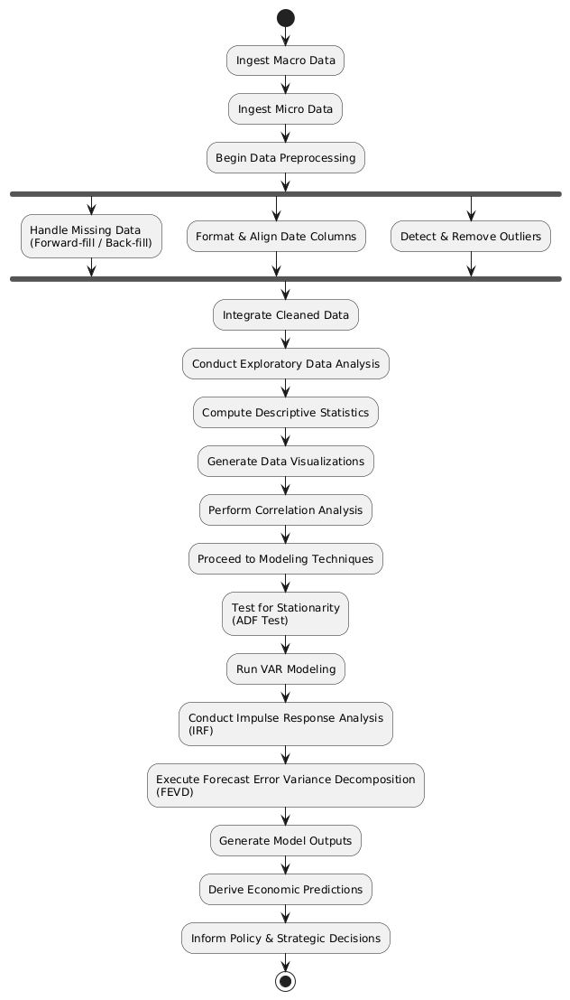
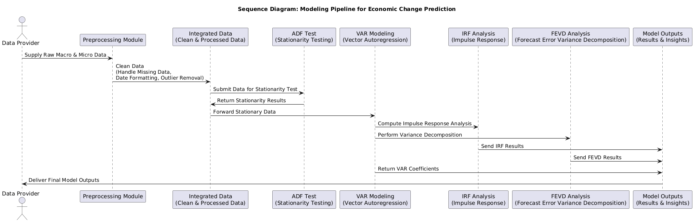

# Integrating Macroeconomic and Microeconomic Data for Economic Change Prediction

## Overview

This project demonstrates the integration of macroeconomic and microeconomic data to predict changes in economic indicators. By combining broad economic trends with detailed sector-specific information, the analysis aims to uncover patterns and relationships that can inform economic forecasting and decision-making.

## Table of Contents

1. [Project Objective](#project-objective)
2. [Data Sources](#data-sources)
3. [Data Integration Approach](#data-integration-approach)
4. [Methodology](#methodology)
   - 4.1 [Data Preprocessing](#data-preprocessing)
   - 4.2 [Exploratory Data Analysis (EDA)](#exploratory-data-analysis-eda)
   - 4.3 [Modeling Techniques](#modeling-techniques)
5. [Results and Discussion](#results-and-discussion)
6. [Conclusion](#conclusion)
7. [Future Work](#future-work)
8. [Acknowledgments](#acknowledgments)
9. [References](#references)

## system architecture:
   1. component diagram:

   

   2. activity diagram:

   

   3. sequence diagram:
   
   

   
## Project Objective

The primary objective of this project is to analyze the impact of macroeconomic indicators on microeconomic sector performance and vice versa. By integrating datasets such as national economic indicators and sector-specific performance metrics, the project seeks to identify correlations and causal relationships that can enhance predictive models for economic changes.

## Data Sources

Data for this project is sourced from two main notebooks, each handling different datasets:

- **Notebook 1: `TSA_Project_preprocessing.ipynb`**: Focuses on preprocessing and analyzing time series data related to economic indicators.
- **Notebook 2: `TSA_projects (1).ipynb`**: Handles the integration of sector-specific data with macroeconomic indicators.

Detailed descriptions of the datasets used, including their sources and attributes, are provided within each notebook.

## Data Integration Approach

The integration of macroeconomic and microeconomic data involves aligning datasets based on common time frames and identifiers. This process includes:

- **Data Alignment**: Synchronizing datasets to ensure that macroeconomic indicators correspond with sector-specific data for the same time periods.
- **Handling Missing Data**: Employing techniques such as forward-fill and back-fill to address gaps in the datasets, ensuring continuity and reliability in the analysis.
- **Normalization**: Standardizing data scales to facilitate meaningful comparisons and integrations between diverse datasets.

## Methodology

### 4.1 Data Preprocessing

Data preprocessing involves cleaning and preparing the datasets for analysis. Key steps include:

- **Missing Data Treatment**: Identifying and imputing missing values using appropriate methods to maintain dataset integrity.
- **Date Handling**: Ensuring that date columns are correctly formatted and aligned across datasets to facilitate accurate time-series analysis.
- **Outlier Detection**: Identifying and addressing outliers that could skew analysis results.

### 4.2 Exploratory Data Analysis (EDA)

EDA is conducted to understand the underlying patterns and relationships within the data. This includes:

- **Descriptive Statistics**: Calculating measures such as mean, median, standard deviation, and interquartile ranges to summarize data distributions.
- **Data Visualization**: Utilizing plots and charts (e.g., line plots, scatter plots, histograms) to visually inspect data trends and relationships.
- **Correlation Analysis**: Assessing the strength and direction of relationships between macroeconomic indicators and sector-specific metrics.

### 4.3 Modeling Techniques

To predict economic changes, various modeling techniques are employed:

- **Stationarity Testing**: Performing tests such as the Augmented Dickey-Fuller (ADF) test to determine if time-series data is stationary, which is essential for certain modeling techniques.
- **Vector Autoregression (VAR) Modeling**: Applying VAR models to capture the linear interdependencies among multiple time-series variables.
- **Impulse Response Function (IRF) Analysis**: Analyzing how economic shocks affect the system over time.
- **Forecast Error Variance Decomposition (FEVD)**: Determining the proportion of forecast error variance of each variable that is attributable to shocks in other variables.

## Results and Discussion

The integrated analysis reveals significant relationships between macroeconomic indicators and sector-specific performances. For instance, certain sectors exhibit pronounced sensitivity to fluctuations in GDP growth rates, while others are more responsive to changes in interest rates. These insights are crucial for policymakers and business leaders in forecasting and strategizing economic decisions.

## Conclusion

Integrating macroeconomic and microeconomic data provides a comprehensive perspective on economic dynamics. This approach enhances the accuracy of predictive models and informs more nuanced economic policies and business strategies.

## Future Work

Future research will focus on:

- **Expanding Data Sources**: Incorporating additional datasets, such as international trade data and consumer sentiment indices, to enrich the analysis.
- **Advanced Modeling**: Employing machine learning techniques to capture non-linear relationships and improve forecasting accuracy.
- **Real-Time Analysis**: Developing frameworks for real-time data processing to facilitate timely economic decision-making.

## Acknowledgments

We acknowledge the contributions of data providers and the support of research institutions that facilitated access to the datasets used in this project.
